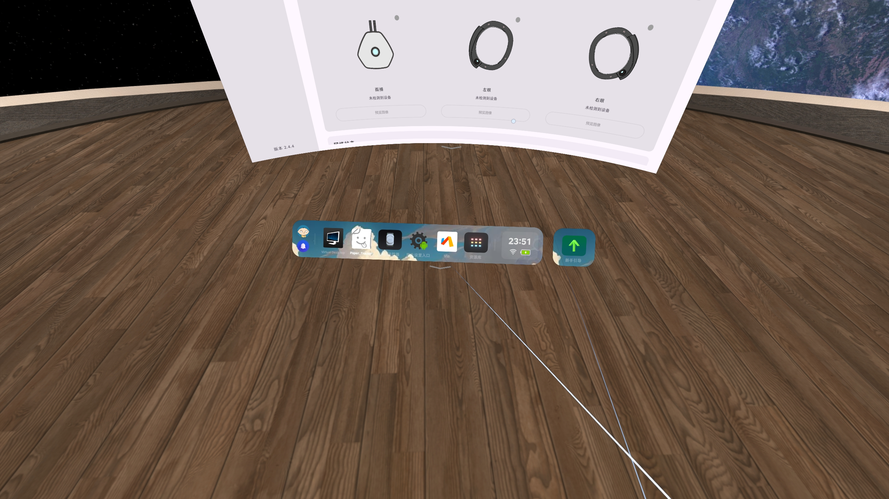

# PicoDockShortcut_chinese

Pico 4 系统 Dock(快捷栏)定制 LSPosed 模块。基于 [chaixshot/PicoDockShortcut](https://github.com/chaixshot/PicoDockShortcut),面向中文固件定制。

> 🌍 **English** · **Русский** · **简体中文**

## 功能

- **自定义 Dock 应用列表**:拦截 `com.pvr.shortcut` 的 `dock_fix_apps.json`,用 GUI 配置你想固定的应用。
- **自定义图标**:拦截 `Image/custom_icon_<pkg>.png`,用应用真实图标替换。
- **运动中心(Fit Center)可控制**:运动中心是 Pico Dock 硬编码入口,原版 JSON 删不掉;本版把它变成一个可在 GUI 里开关的项。
- **自定义 Dock 背景图**:在 GUI 里选一张图片当 Dock 条背景,自带固定比例裁剪框,新手引导条同步同一张图。

## 自定义 Dock 背景图

Dock 条本身在系统里是固定的纯色 `#FF1F1F1F`,本模块让你换成任意图片。



**用法**:打开管理器 GUI → 底部"Dock 背景" → 选择背景图片 → 在裁剪框里拖动/缩放框选想要的区域 → 确认 → 呼出 Dock 生效。

**实现要点**:

- hook `com.pvr.shortcut.service.ShortcutViewContainer.inflateRootView(Context)`,拿到 Dock 根视图后替换背景。
- 目标视图定位:取 `dock_container`(`0x7f09009c`)下第一个 `id != 0x7f09005b` 的 `LinearLayout` 子节点 = 可见的 Dock 条;Guide(新手引导)= `0x7f09005b`,两者共用同一张 Bitmap、各自保留自己的圆角。
  - **不能直接改 `dock_container` 本身**——它是透明容器,给它上背景会把 Dock 条与 Guide 之间的透明空隙填满。
- 自定义 `RoundedBgDrawable : Drawable`,在 `onBoundsChange()` 里按真实 bounds 建 `BitmapShader`(Matrix center-crop,不变形)+ `Path.addRoundRect` 圆角。
  - inflate 阶段 View 还没测量(`width/height == 0`),所以**不能**在 hook 里直接预渲染 Bitmap,必须等 bounds 回调。
  - 圆角从原 `GradientDrawable` 提取(实测 38px),读不到时兜底 38f。
- 用户图片存 `/data/user/0/com.hamer.dockshortcut/dock_bg.png`,目录 755 + 文件 644,否则以 system(uid 1000)运行的 `com.pvr.shortcut` 读不到。

**关于裁剪比例**:Dock 高度固定 `main_view_height = 120dp`,宽度是 `wrap_content` 随应用数量变化(左区约 176dp + 右区约 138dp + 每个应用 84dp),还会因"最近/运行中应用"临时变宽。所以裁剪按系统硬上限 `dock_max_width 1800dp / 120dp = 15:1` 出图,保证之后加图标或打开应用时右侧也不会缺画面。背景**左对齐**绘制,Dock 越宽右侧露出的画面越多。

## 构建与部署(简版)

```bash
# 本地已有 Android SDK 且 local.properties 指向它,然后:
./gradlew assembleDebug
# 产物: app/build/outputs/apk/debug/app-debug.apk
# 设备(Zygisk-Vector):
adb install -r app-debug.apk
adb shell su -c '/data/adb/lspd/cli modules enable com.hamer.dockshortcut'
adb shell su -c '/data/adb/lspd/cli scope add com.hamer.dockshortcut com.pvr.shortcut/0'
```

> Vector 启用模块/scope 必须用 `vector-cli`,不能直接改 `modules_config.db`。

## 技术细节(逆向要点)

- **运动中心入口**:`com.pvr.shortcut.dock.datamanager.FixAppDataManager.addRemoveFitCenterApp`,触发条件是 `DockUtils.isUserCenterNoFit()==true`(ToB 或中国版 Phoenix)。
- **实际 app**:`com.picovr.tobvrusercenter.MainActivity` / `com.picovr.vrusercenter.MainActivity`。
- **Dock 面板**:`com.pvr.shortcut` 是 `com.picovr.systemext` 控制的 VR 浮动面板(type 3002),无法用普通 am start 强制呼出。

## 许可证

MIT(继承原仓库)。

---

# English

LSPosed module that customizes the Pico 4 system Dock (quick bar). Based on [chaixshot/PicoDockShortcut](https://github.com/chaixshot/PicoDockShortcut), customized for the Chinese firmware.

## Features

- **Custom Dock app list**: intercepts `com.pvr.shortcut`'s `dock_fix_apps.json` and lets you pin your own apps via the GUI.
- **Custom icons**: intercepts `Image/custom_icon_<pkg>.png` and replaces icons with the app's real icon.
- **Fit Center control**: Fit Center is a hard-coded Dock entry that the original JSON cannot remove; this version turns it into a toggle in the GUI.
- **Custom Dock background image**: pick an image in the GUI (with a fixed-ratio crop box); the onboarding guide bar uses the same image.

## Custom Dock background

The Dock bar is a fixed solid color (`#FF1F1F1F`) in the system. This module lets you replace it with any image.


**Usage**: open the manager GUI → "Dock background" at the bottom → pick an image → drag/zoom to crop the area you want → confirm → summon the Dock to apply.

**Implementation notes**:

- Hooks `com.pvr.shortcut.service.ShortcutViewContainer.inflateRootView(Context)` and swaps the background once the root view is available.
- Target view: the first `LinearLayout` child of `dock_container` (`0x7f09009c`) whose `id != 0x7f09005b` = the visible Dock bar; the Guide (onboarding) = `0x7f09005b`. Both share the same Bitmap and keep their own corner radii.
  - **Never set the background on `dock_container` itself** — it is a transparent container; doing so fills the transparent gap between the Dock bar and the Guide.
- Custom `RoundedBgDrawable : Drawable` builds the `BitmapShader` (Matrix center-crop, no distortion) + `Path.addRoundRect` corners in `onBoundsChange()` using the real bounds.
  - At inflate time the view is not measured yet (`width/height == 0`), so you cannot pre-render the Bitmap in the hook; you must wait for the bounds callback.
  - Corner radius is read from the original `GradientDrawable` (measured 38px), falling back to 38f.
- The user image is stored at `/data/user/0/com.hamer.dockshortcut/dock_bg.png`; the directory must be 755 and the file 644, otherwise `com.pvr.shortcut` (running as system, uid 1000) cannot read it.

**About the crop ratio**: the Dock height is fixed (`main_view_height = 120dp`), the width is `wrap_content` and grows with the app count (left area ≈176dp + right area ≈138dp + 84dp per app), and it temporarily widens when "recent/running apps" appear. So the crop uses the system hard cap `dock_max_width 1800dp / 120dp = 15:1`, guaranteeing the right side never runs out of artwork when you add icons or open apps. The background is drawn **left-aligned**: the wider the Dock, the more of the image shows on the right.

## Build & deploy (short)

```bash
# Have the Android SDK locally with local.properties pointing at it, then:
./gradlew assembleDebug
# Output: app/build/outputs/apk/debug/app-debug.apk
# On device (Zygisk-Vector):
adb install -r app-debug.apk
adb shell su -c '/data/adb/lspd/cli modules enable com.hamer.dockshortcut'
adb shell su -c '/data/adb/lspd/cli scope add com.hamer.dockshortcut com.pvr.shortcut/0'
```

> Enabling the module/scope must be done via `vector-cli`, never by editing `modules_config.db` directly.

## Technical notes (reverse-engineering)

- **Fit Center entry**: `com.pvr.shortcut.dock.datamanager.FixAppDataManager.addRemoveFitCenterApp`, triggered when `DockUtils.isUserCenterNoFit()==true` (ToB or Chinese Phoenix firmware).
- **Actual apps**: `com.picovr.tobvrusercenter.MainActivity` / `com.picovr.vrusercenter.MainActivity`.
- **Dock panel**: `com.pvr.shortcut` is a VR floating panel (type 3002) controlled by `com.picovr.systemext`; it cannot be summoned with a plain `am start`.

## License

MIT (inherited from the upstream repo).

---

# Русский

LSPosed-модуль для настройки системного Dock (панели быстрого доступа) Pico 4. Основан на [chaixshot/PicoDockShortcut](https://github.com/chaixshot/PicoDockShortcut), адаптирован для китайской прошивки.

## Возможности

- **Свой список приложений в Dock**: перехватывает `dock_fix_apps.json` у `com.pvr.shortcut` и позволяет закрепить свои приложения через GUI.
- **Свои значки**: перехватывает `Image/custom_icon_<pkg>.png` и заменяет значки на настоящие значки приложений.
- **Управление Fit Center**: Fit Center — жёстко зашитый пункт Dock, который нельзя удалить через оригинальный JSON; эта версия превращает его в переключатель в GUI.
- **Свой фон Dock**: выберите изображение в GUI (с фиксированным соотношением сторон для кадрирования); панель подсказок (Guide) использует то же изображение.

## Свой фон Dock

Полоса Dock в системе имеет фиксированный сплошной цвет (`#FF1F1F1F`). Этот модуль позволяет заменить его на любое изображение.


**Использование**: откройте GUI менеджера → «Dock background» внизу → выберите изображение → перетаскивайте/масштабируйте, чтобы выбрать нужную область → подтвердите → вызовите Dock для применения.

**Технические детали**:

- Хук `com.pvr.shortcut.service.ShortcutViewContainer.inflateRootView(Context)`; фон меняется после получения корневого view.
- Целевой view: первый дочерний `LinearLayout` у `dock_container` (`0x7f09009c`) с `id != 0x7f09005b` = видимая полоса Dock; Guide (подсказки) = `0x7f09005b`. Оба используют один Bitmap и сохраняют свои радиусы скругления.
  - **Нельзя менять фон самого `dock_container`** — это прозрачный контейнер; иначе заполнится прозрачный зазор между полосой Dock и Guide.
- Кастомный `RoundedBgDrawable : Drawable` строит `BitmapShader` (Matrix center-crop, без искажений) + `Path.addRoundRect` в `onBoundsChange()` по реальным границам.
  - На этапе inflate view ещё не измерен (`width/height == 0`), поэтому нельзя отрисовать Bitmap прямо в хуке — нужно ждать колбэк границ.
  - Радиус скругления берётся из исходного `GradientDrawable` (измерено 38px), по умолчанию 38f.
- Изображение хранится в `/data/user/0/com.hamer.dockshortcut/dock_bg.png`; каталог должен быть 755, файл 644, иначе `com.pvr.shortcut` (работает как system, uid 1000) не сможет его прочитать.

**О соотношении сторон**: высота Dock фиксирована (`main_view_height = 120dp`), ширина — `wrap_content` и растёт с числом приложений (левая зона ≈176dp + правая ≈138dp + 84dp на приложение), а при появлении «недавних/запущенных приложений» временно становится ещё шире. Поэтому кадрирование идёт по аппаратному пределу `dock_max_width 1800dp / 120dp = 15:1`, чтобы при добавлении значков или открытии приложений справа никогда не заканчивалось изображение. Фон рисуется **слева**: чем шире Dock, тем больше изображения видно справа.

## Сборка и установка (кратко)

```bash
# Нужен Android SDK, local.properties должен указывать на него:
./gradlew assembleDebug
# Результат: app/build/outputs/apk/debug/app-debug.apk
# На устройстве (Zygisk-Vector):
adb install -r app-debug.apk
adb shell su -c '/data/adb/lspd/cli modules enable com.hamer.dockshortcut'
adb shell su -c '/data/adb/lspd/cli scope add com.hamer.dockshortcut com.pvr.shortcut/0'
```

> Включать модуль и скоуп нужно только через `vector-cli`, не редактируя напрямую `modules_config.db`.

## Технические заметки (реверс-инжиниринг)

- **Точка входа Fit Center**: `com.pvr.shortcut.dock.datamanager.FixAppDataManager.addRemoveFitCenterApp`, срабатывает при `DockUtils.isUserCenterNoFit()==true` (ToB или китайская прошивка Phoenix).
- **Фактические приложения**: `com.picovr.tobvrusercenter.MainActivity` / `com.picovr.vrusercenter.MainActivity`.
- **Панель Dock**: `com.pvr.shortcut` — VR-плавающая панель (type 3002), управляется `com.picovr.systemext`; её нельзя вызвать обычным `am start`.

## Лицензия

MIT (унаследована от исходного репозитория).