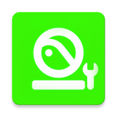

# PicoDockShortcut
[English](README.md) | [中文](README_zh.md) | [Русский](README_ru.md)

### 轻松管理 Pico 4 Dock 栏固定快捷方式。 为您的 VR 体验定制开发的伴侣项目。

## 👓 截图
<image src="Resource/Android_Pico2Dock.jpeg" width="400"/>
  
## 🌟 核心功能
*   **🤌 拖拽排序：** 通过直观的长按和拖拽手势轻松整理 Dock 栏快捷方式。
*   **🖼️ 自定义应用图标：** 从设备存储中选取自己的图片，自定义任何快捷方式的外观。
*   **🚀 图标缓存：** 优化的图标缓存机制确保 Dock 加载速度显著提升。
*   **🌐 多语言支持：** 完整支持 26+ 种语言，内置语言选择器可覆盖系统默认设置。
*   **🔄 自动重启：** 应用更改后自动重启 Dock 服务，确保设置立即生效。
*   **🛡️ 系统健康检查：** 内置诊断功能可检测 Root 权限和 LSPosed 状态，如果未满足要求将弹出清晰的警告。

## ⛏️ 必备条件
*   **设备：** Pico 4 头戴设备（支持海外版和中国版固件）。
*   **权限：** 需要 **[Root 权限](https://pico4.wiki/guides/root/01-root/)** 以修改系统文件。
*   **环境：** 必须安装并激活 **[LSPosed 框架](https://github.com/JingMatrix/Vector/releases/tag/v2.0)**。
*   **作用域：** 确保在 LSPosed 模块作用域中勾选了 `Dock` (`com.pvr.shortcut`)。

## 📐 如何使用？
1.  在您的头显上 **安装** `PicoDockShortcut` APK。
2.  在 LSPosed 管理器中 **启用** 该模块。
3.  **选择作用域：** 确保在模块的作用域设置中勾选了 `Dock` (`com.pvr.shortcut`)。
4.  **重启** 设备或重启 `com.pvr.shortcut` 进程以激活 Hook。
5.  **打开 PicoDockShortcut：**
    *   **添加应用：** 点击 `+` 插槽从已安装列表中选择应用。
    *   **排序：** 长按并拖动任何插槽以更改其在 Dock 上的位置。
    *   **自定义图标：** 点击插槽左上角的图像图标，从存储中选择自定义图片。
    *   **更换应用：** 点击应用插槽主体以将其更换为另一个应用。
    *   **删除：** 点击右上角的删除图标以移除快捷方式。
6.  **应用：** 点击 **应用 (Apply)** 按钮。应用将请求 Root 权限，保存配置并自动重启 Dock 服务。

## ⁉️ 为什么我的更改没有生效？
*   检查 LSPosed 模块是否已激活。
*   确保作用域中已选择 `Dock` (`com.pvr.shortcut`) 应用。
*   验证您是否已授予 PicoDockShortcut **Root 权限**。
*   如果重启服务后更改仍未生效，请尝试完整重启设备。

## ⁉️ 自定义图标是如何工作的？
应用将您选择的图片保存到 `/data/user/0/com.hamer.dockshortcut/Image/Custom`。LSPosed Hook 会拦截 Dock 对资源的请求，并提供这些自定义文件。

## 🔃 语言支持
本应用支持多种语言，包括英语、中文（简体/繁体）、泰语、德语、法语等。您可以使用右上角的 **语言选择器**（地球图标）覆盖系统语言。

## 🙏 特别鸣谢：
*   [LSPosed Framework](https://github.com/LSPosed/LSPosed) - 提供强大的 Hook 引擎。
*   [Jetpack Compose](https://developer.android.com/compose) - 现代声明式 UI 工具包。
*   [Material 3](https://m3.material.io/) - 精美的设计组件。
